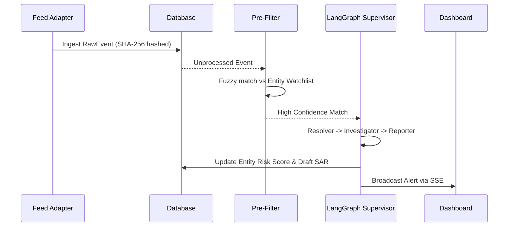

# System Design & Architecture

## 1. Product Vision
The Continuous KYC Autonomous Auditor (CXKYC) aims to revolutionize the compliance industry by shifting from point-in-time KYC checks to real-time, continuous auditing. By leveraging Autonomous Agents, the product reduces the false positive burden on compliance officers while ensuring all high-risk events (adverse media, sanctions, anomalies) are triaged instantly with verifiable, explainable evidence.

## 2. Approach
The system is designed using an **iterative, architecture-first methodology** centered around an Event-Driven Architecture (EDA) and a Multi-Agent LLM Orchestration framework. All incoming data streams are normalized into canonical `RawEvent` objects. This allows a decoupled pipeline where agents process events uniformly regardless of their source (news, internal transactions, or government sanctions lists).

## 3. System Architecture
CXKYC is decomposed into a strict layered architecture to ensure separation of concerns:
- **Client Layer:** Vanilla JS frontend communicating via REST and Server-Sent Events (SSE).
- **Application Layer:** FastAPI backend exposing clean endpoints and managing the asynchronous processing/ingestion loops.
- **Agent Runtime Layer:** A LangGraph network orchestrating specialist agents using a shared state and conditional routing.
- **Domain Services:** Deterministic scoring engines, fuzzy matching (rapidfuzz), and business logic.
- **Storage Layer:** SQLite (WAL mode) for transactional data, and ChromaDB for vector storage.

## 4. Multi-Agent Architecture
Intelligence is decomposed into specialist agents overseen by a LangGraph supervisor:
1. **Resolver Agent:** Disambiguates unstructured text to identify the exact entity involved using semantic search (RAG) against known entity profiles.
2. **Classifier/Scoring Engine:** A deterministic engine (not LLM-based) calculates risk scores using strict numerical matrices defined in `policy.yaml`.
3. **Investigator Agent:** Gathers deep context and evidence for high-risk events.
4. **Reporter Agent:** Drafts the Suspicious Activity Report (SAR) narrative citing the evidence gathered by the Investigator.

## 5. Trust Layer
The trust layer ensures the AI remains a verifiable assistant rather than a black-box decision maker:
- **Explainability by Construction:** The LLM does not generate risk scores; it provides semantic understanding, while a deterministic rule engine calculates the math.
- **Human-in-the-loop:** No SAR is ever filed autonomously. Every drafted SAR requires human compliance officer review and sign-off.

## 6. Data Flow
The system operates as three concurrent loops sharing a single database:
- **Loop A (Ingestion):** Feed Adapters poll sources every 15s, normalize raw data, and deduplicate using SHA-256 content hashes.
- **Loop B (Processing):** Events undergo rapid fuzzy pre-filtering to drop noise. Matches are sent through the LangGraph pipeline for resolution and scoring. Valid alerts are pushed via SSE.
- **Loop C (Review):** Human officers act on the alerts in the dashboard.

## 7. Sequence Diagram

## 8. Database Design
The relational store uses SQLite (in WAL mode for concurrency) modeled via SQLAlchemy. 
Core Domain Models:
- `Entity`: The core KYC profile.
- `RawEvent`: The normalized external signal.
- `Alert`: A triggered investigation (Medium, High, Critical).
- `SAR`: The Suspicious Activity Report drafted by the AI.
- `AuditLog`: The immutable ledger of actions.

## 9. Retrieval-Augmented Generation (RAG)
CXKYC uses **ChromaDB** for RAG, housing three key collections:
- `regulatory_corpus`: Contains compliance regulations. Agents query this to legally ground their SAR narratives.
- `entity_cards`: Contains rich text representations of KYC profiles, enabling the Resolver agent to semantically match messy news articles to internal database records.
- `event_context`: Historical events for long-term pattern recognition.

## 10. Audit System
**Append-only auditability** is deeply ingrained in the architecture. Every AI judgment (including dismissals due to low confidence) and every human action (alert escalation, SAR edits) is written to a tamper-evident, hash-chained `AuditLog`. No record is ever mutated, providing regulators with a mathematically verifiable chain of custody for every decision.

## 11. Human Review Workflow
1. A Critical Alert triggers a SAR draft.
2. The draft is queued with a `pending_review` status.
3. The Compliance Officer opens the SAR on the dashboard, viewing the AI's narrative alongside exact evidence citations.
4. The Officer can edit the narrative, request more info (re-dispatching the Investigator), or Reject/Approve the SAR.
5. The final decision is logged in the Audit chain.
